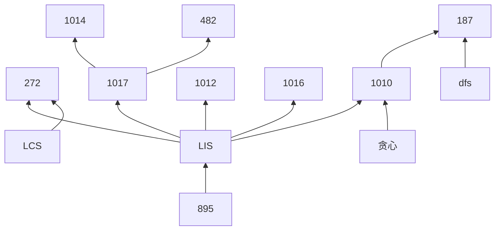

把最长上升子序列模型总结一下
<!--more-->


[895. 最长上升子序列](https://www.acwing.com/problem/content/description/897/)

模板题，dp复杂度O(n^2)
```c++
#include <iostream>
#include <algorithm>
using namespace std;

const int N = 1010;
int a[N], f[N];

int main()
{
    int n;
    cin >> n;
    for(int i = 1; i <= n; i++) cin >> a[i];
    for(int i = 1; i <= n; i++)
    {
        f[i] = 1;
        for(int j = 1; j < i; j++)
            if(a[j] < a[i])
                f[i] = max(f[i], f[j] + 1);
    }
    int res = 0;
    for(int i = 1; i <= n; i++)
        res = max(res, f[i]);
    cout << res << endl;
    return 0;
}
```

[896. 最长上升子序列 II](https://www.acwing.com/problem/content/898/)

模板题，贪心，时间复杂度O(nlogn)，由于这里主要说的是动态规划，因此下面题用的都是O(n^2)的算法，都可替换成贪心。

贪心的思路是：枚举每个元素，找到当前状态下，最长且结尾值小于当前元素的序列，并从这些序列中，找出结尾值最小的那一个（结尾值越小意味着可以增加长度的概率越大）。

主要思路便是将序列按长度进行分类，每一类只保存序列结尾值最小的那一个序列，这样每一类保存的值便是随着长度增大，单调递增。枚举a[i]时，每次二分出结尾值小于a[i]，但值最大的那一类序列。
```c++
#include <iostream>
#include <algorithm>
using namespace std;

const int N = 100010;

int n, a[N], q[N];

int main()
{
    cin >> n;
    for(int i = 0; i < n; i++) cin >> a[i];
    
    q[0] = -2e9;
    int len = 0;
    for(int i = 0; i < n; i++)
    {
        int l = 0, r = len;
        while(l < r)
        {
            int mid = l + r + 1 >> 1;
            if(q[mid] < a[i]) l = mid;
            else r = mid - 1;
        }
        len = max(len, l + 1);
        q[l+1] = a[i];
    }
    cout << len << endl;
    return 0;
}
```


[1017. 怪盗基德的滑翔翼](https://www.acwing.com/problem/content/description/1019/)

由于怪盗基德可以选择任意一个方向逃跑，即可以从左到右，也可以从右到左，因此需要分别求。向下滑行即求最长下降子序列。
```c++
#include <iostream>
#include <algorithm>
using namespace std;

const int N = 110;
int a[N], f[N];

int main()
{
    int k;
    cin >> k;
    
    while(k--)
    {
        int n, res = 0;
        cin >> n;
        for(int i = 0; i < n; i++) cin >> a[i];
        // 从左到右
        for(int i = 0; i < n; i++)
        {
            f[i] = 1;
            for(int j = 0; j < i; j++)
                if(a[j] > a[i])
                    f[i] = max(f[i], f[j] + 1);
        }
        for(int i = 0; i < n; i++)
            res = max(res, f[i]);
        // 从右到左
        for(int i = n-1; i >= 0; i--)
        {
            f[i] = 1;
            for(int j = n-1; j > i; j--)
                if(a[j] > a[i])
                    f[i] = max(f[i], f[j] + 1);
        }
        for(int i = n-1; i >= 0; i--)
            res = max(res, f[i]);
        cout << res << endl;
    }
    return 0;
}
```
[1014. 登山](https://www.acwing.com/problem/content/1016/)

其实就是分别从两个方向求一下最长上升子序列
```c++
#include <iostream>
#include <algorithm>

using namespace std;
const int N = 1010;
int a[N], f[N];

int main()
{
    int n, res = 0;
    cin >> n;
    for(int i = 0; i < n; i++) cin >> a[i];
    
    for(int i = 0; i < n; i++)
    {
        f[i] = 1;
        for(int j = 0; j < i; j++)
            if(a[j] < a[i])
                f[i] = max(f[i], f[j] + 1);
    }
    for(int i = n-1; i >= 0; i--)
    {
        int t = f[i]; // 暂时保存，这样就不用开俩数组了
        f[i] = 1;
        for(int j = n-1; j > i; j--)
            if(a[j] < a[i])
                f[i] = max(f[i], f[j] + 1);
        res = max(res, f[i] + t - 1);
    }
    cout << res <<endl;
    return 0;
}
```
[482. 合唱队形](https://www.acwing.com/problem/content/484/)

跟登山一个思路，只不过答案是用总数减去求出的最长序列长度
```c++
#include <iostream>
#include <algorithm>
using namespace std;

const int N = 110;
int a[N], f[N];

int main()
{
    int n, res = 0;
    cin >> n;
    for(int i = 0; i < n; i++) cin >> a[i];
    
    for(int i = 0; i < n; i++)
    {
        f[i] = 1;
        for(int j = 0; j < i; j++)
            if(a[j] < a[i])
                f[i] = max(f[i], f[j] + 1);
    }
    
    for(int i = n-1; i >= 0; i--)
    {
        int t = f[i];
        f[i] = 1;
        for(int j = n-1; j > i; j--)
            if(a[j] < a[i])
                f[i] = max(f[i], f[j] + 1);
        res = max(res, f[i] + t - 1);
    }
    cout << n - res << endl;
    return 0;
}
```
[1012. 友好城市](https://www.acwing.com/problem/content/1014/)

排序后其实就是求最长上升子序列了
```c++
#include <iostream>
#include <algorithm>
using namespace std;

typedef pair<int, int> PII;
const int N = 5010;
int f[N];
PII a[N];

int main()
{
    int n;
    cin >> n;
    
    for(int i = 0; i < n; i++)
        cin >> a[i].first >> a[i].second;
    sort(a, a + n);
    
    for(int i = 0; i < n; i++)
    {
        f[i] = 1;
        for(int j = 0; j < i; j++)
            if(a[j].second < a[i].second)
                f[i] = max(f[i], f[j] + 1);
    }
    int res = 0;
    for(int i = 0; i < n; i++)
        res = max(res, f[i]);
    cout << res << endl;
    return 0;
}
```

[1016. 最大上升子序列和](https://www.acwing.com/problem/content/1018/)

最长上升子序列问题稍微变了一下，求和的话每次加上a[i]即可。
```c++
#include <iostream>
#include <algorithm>
using namespace std;

const int N = 1010;
int a[N], f[N];

int main()
{
    int n;
    cin >> n;
    for(int i = 0; i < n; i++) cin >> a[i];
    
    for(int i = 0; i < n; i++)
    {
        f[i] = a[i];
        for(int j = 0; j < i; j++)
            if(a[j] < a[i])
                f[i] = max(f[i], f[j] + a[i]);
    }
    int res = 0;
    for(int i = 0; i < n; i++)
        res = max(res, f[i]);
    cout << res << endl;
    return 0;
}
```

[1010. 拦截导弹](https://www.acwing.com/problem/content/1012/)

第一问就是求最长不上升子序列

第二问是一个贪心的思路，遍历序列a，将a[i]放到末尾值比它大但是是全部序列中最小的序列末尾，即将该序列末尾值替换为a[i]。
```c++
#include <iostream>
#include <algorithm>
using namespace std;

const int N = 1010;
int a[N], f[N], g[N];
int n;

int main()
{
    while(cin >> a[n]) n++;
    
    for(int i = 0; i < n; i++)
    {
        f[i] = 1;
        for(int j = 0; j < i; j++)
            if(a[j] >= a[i])
                f[i] = max(f[i], f[j] + 1);
    }
    int res = 0;
    for(int i = 0; i < n; i++)
        res = max(res, f[i]);
    cout << res << endl;
    
    int cnt = 0;
    for(int i = 0; i < n; i++)
    {
        int k = 0;
        while(k < cnt && g[k] < a[i]) k++;
        g[k] = a[i];
        if(k >= cnt) cnt++;
    }
    cout << cnt << endl;
    return 0;
}
```

**未完待续...**